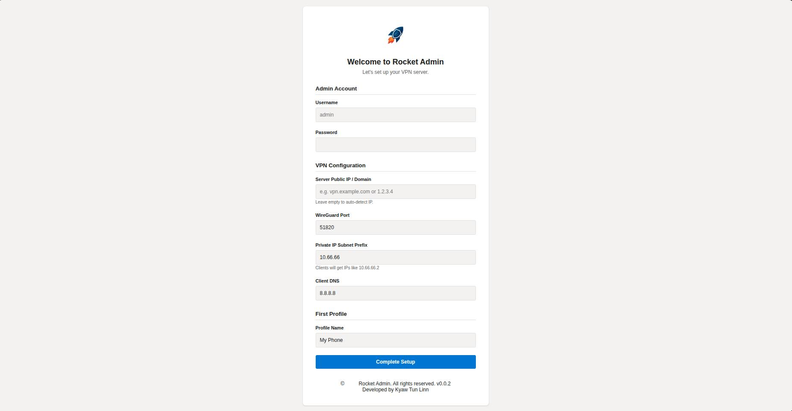
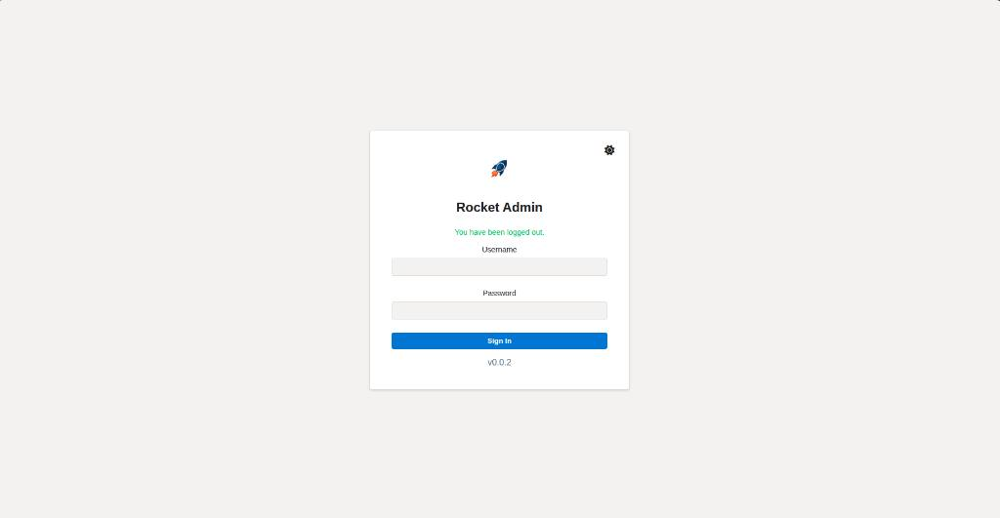
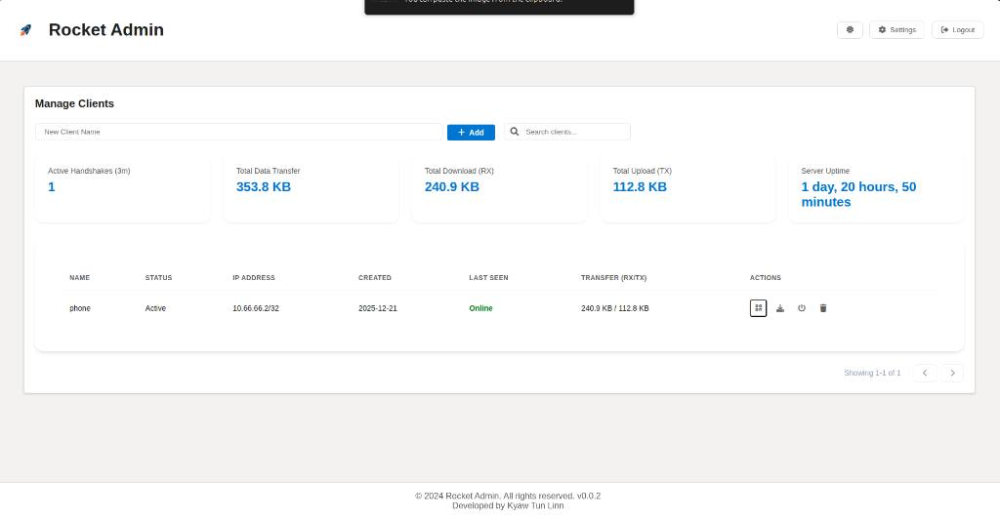
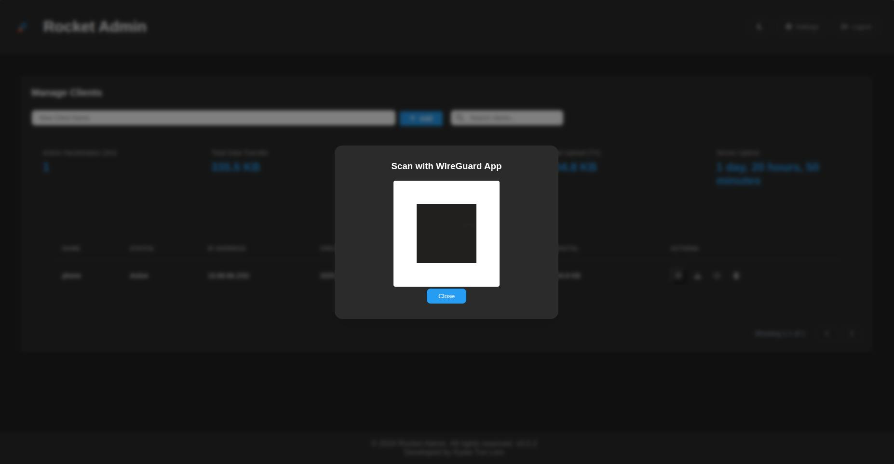
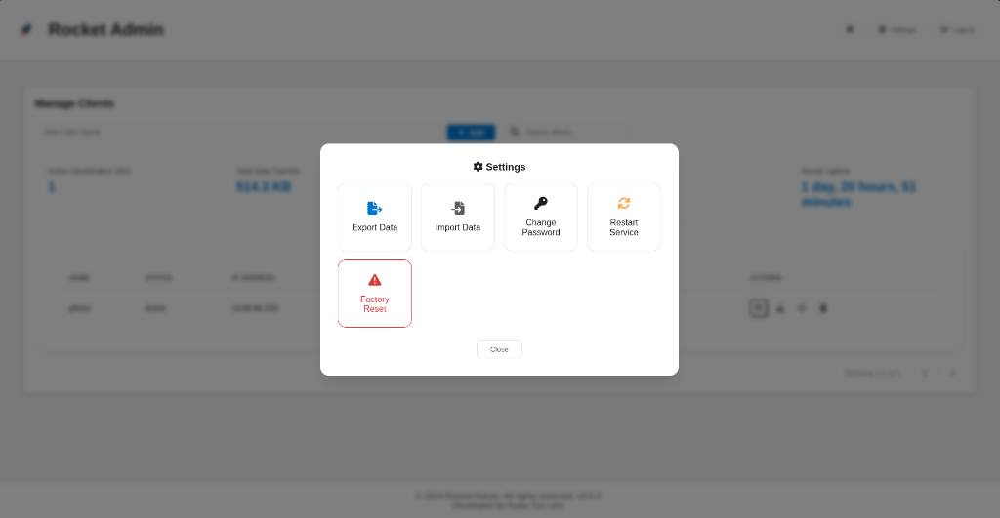
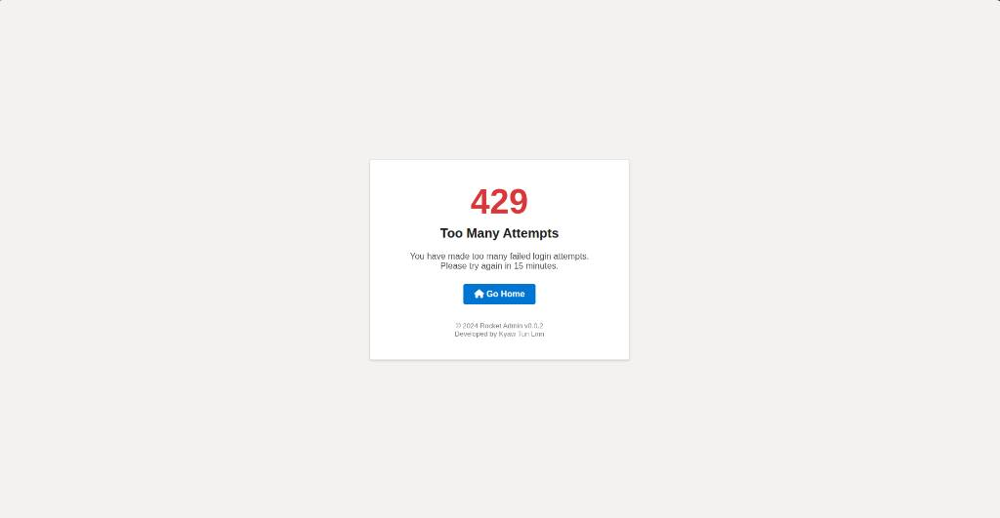
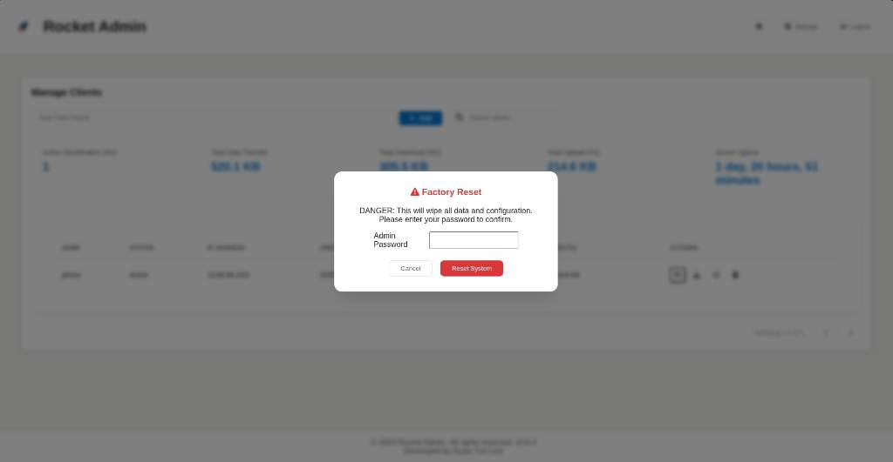

# Rocket VPN Server ( version 0.0.2 )
 
 
A Spring Boot application to manage a WireGuard VPN server with a modern web interface.

## Features
- **Easy Client Management**: Create, disable, and delete VPN clients.
- **QR Code Support**: Scan to connect mobile devices instantly.
- **Monitoring**: View real-time connection status and data usage.
- **Secure**: Admin login required.

---  
 
 **Set Up Page**
---
 
 **Login Page**
--- 
 
 **Dashboard**
---
 
 **Scan QR**
---
 
 **Settings**
---
 
 **Rate Limiting**
---
 
 **Reset Settings**
---

## Prerequisites
- Debian 12 (Recommended) or Ubuntu 24.04 LTS
- Root privileges

## Quick Start

### 1. Build the Application
```bash
sudo apt update && sudo apt upgrade -y && sudo apt-get install -y wireguard wireguard-tools iproute2 qrencode iptables curl openjdk-21-jdk -y

Enabling IP Forwarding..."
 Uncomment net.ipv4.ip_forward=1 in /etc/sysctl.conf if not already enabled
sudo sysctl -p

./mvnw clean package -DskipTests
```

### 2. Run
```bash
java -jar yourgenerated.jar
```
The application will start automatically on port 8080.

### 3. Access the Dashboard
Open your browser and navigate to:
`http://<YOUR_SERVER_IP>:8080`


## Troubleshooting
- **No Internet**: Ensure IP forwarding is enabled.
- **Cannot Connect**: Check if UDP port `51820` is open in your firewall.

